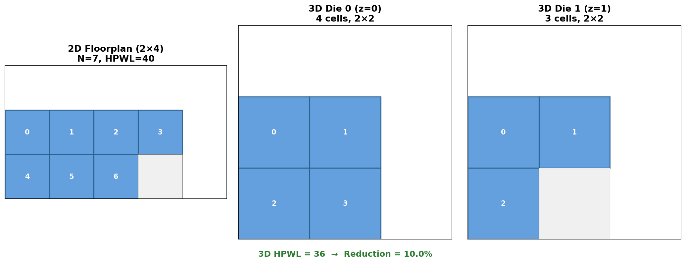
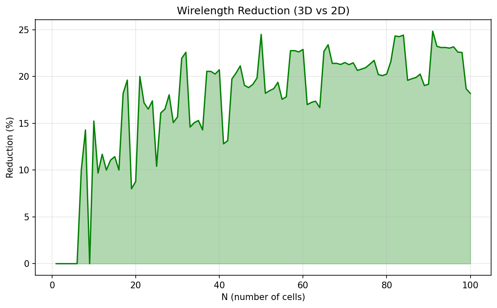
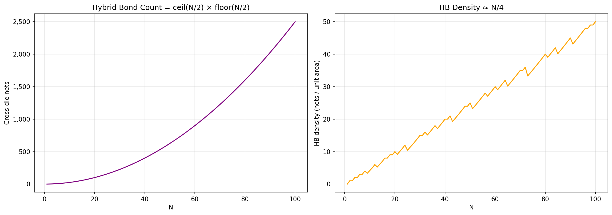
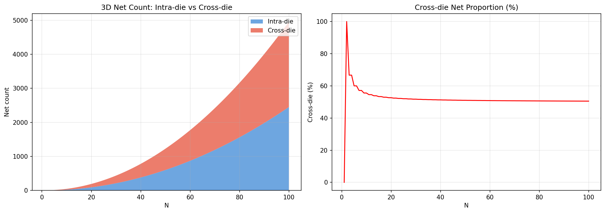
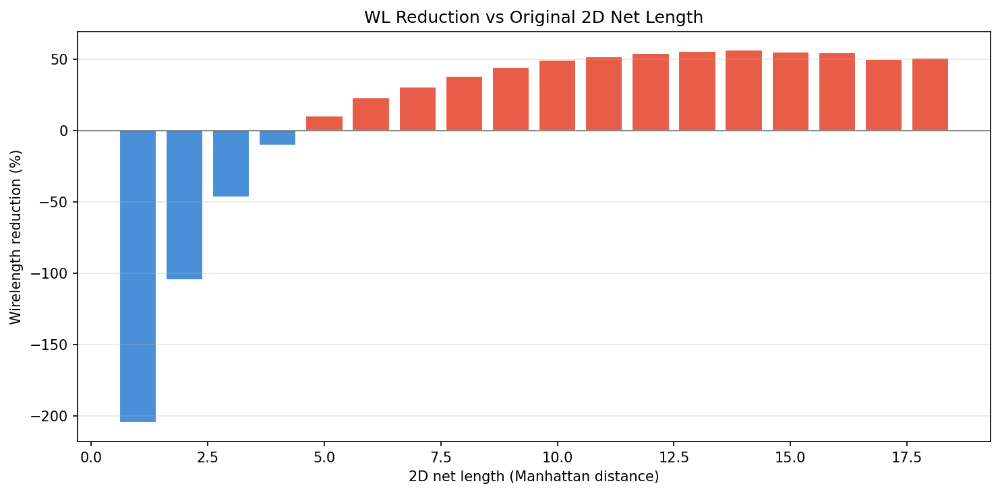
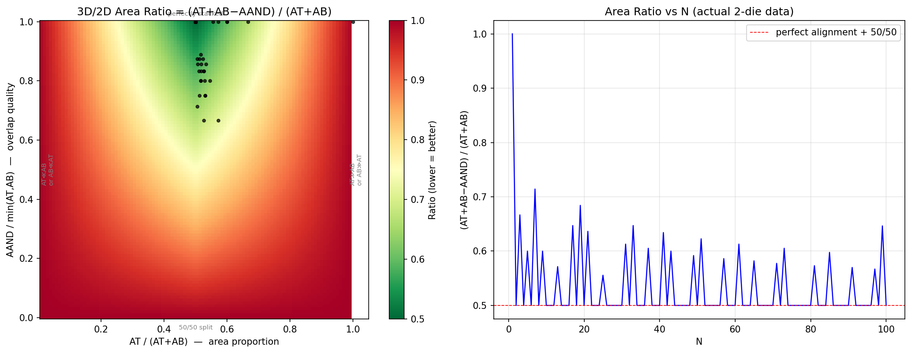
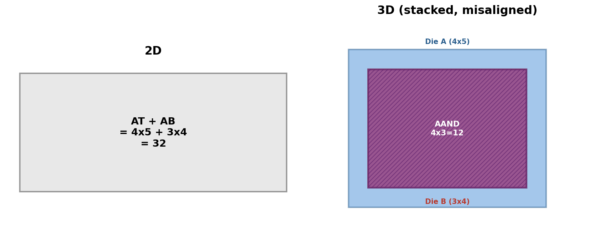

# logic-folding-geometry

几何思想实验系列：从完全图出发，逐步逼近真实 3D 物理设计的可行域。

以 N 个标准单元的全互连假设（Rent 指数 p=1）为上界，从多个维度量化 2D→双 Die 3D 堆叠的变化——线长收益、HB 密度、net 组分、长/短线非对称性——并导出分割器的簇大小阈值和 cost function 先验。后续逐步引入 Rent 约束（p<1）逼近真实电路。

---

### 本文是什么

在 AI-native EDA 的技术栈里，本文是 **Strategy Agent 的 physics prior**——不是预测芯片性能的精确模型，而是告诉 Agent 一个设计值不值得做 3D fold、应该往哪个方向切。

```text
Step 1: 证明 3D folding 有理论收益    ← 本文 (logic-folding-geometry)
   ↓
Step 2: 关键问题变成 "怎么 fold"       → agentic_3d_partition
   ↓
Step 3: 整个 PD flow 都应该 agent 化    → agentic_tao_physical_design_flow
   ↓
Step 4: 形成 autonomous circuit optimizer
```

没有这层物理直觉，Agent 只能盲搜；有了它，Agent 知道什么设计值得 fold、优先切哪些 net、什么簇大小是可行的。

**本文的语言**是曼哈顿距离 → 密度 → AAND/AOR → Rent's Rule → 夹逼阈值。

### 本文不是什么

不是签核报告，不是时序收敛指南，不讨论 slack / hold / WNS / TNS / OCV / derate。这些是实现噪声，会在真实物理设计中叠加，但不改变本文结论的方向性。本文给的是**几何下界和上界**——一个分割器在翻开任何 STA 报告之前就应该知道的事。

### 正视距离

以下差距不是模型的缺陷，是工程落地必须面对的下一层问题，每一件都有明确的价值：

几何模型做了的：曼哈顿跳数、单元中心间距、均匀面积、完全图 p=1、双 Die 均分、等 z 间距。

还没碰的坑：实际 pin 位置带来的 HPWL 包围盒误差、绕线拥塞下的兜路惩罚、TSV/HB 寄生远大于平面金属、不同驱动强度单元的面积差异、热和 IR 在堆叠后的恶化、跨 Die 时钟 skew、真实 netlist 的 Rent 约束。

**先圈边界，再填数字。** 路线：几何推导（本文）→ TaiWei-Pin-3D 验证 → TAO 后端环 → TNS/WNS 收敛。

---

## 模型与假设

N 个**全互连**的标准单元（完全图 $K_N$，共 $N(N-1)/2$ 条 net），按最优空间密铺排列，比较 2D vs 双 Die 3D 的总曼哈顿线长。

### 模型假设

| 参数 | 取值 | 说明 |
|------|------|------|
| 互联模型 | 完全图 $K_N$ | 每对单元之间都有一条 net（最悲观的假设） |
| 距离度量 | 曼哈顿距离 | 相邻格子间距 = 1 |
| 2D Floorplan | 最优矩形 | 最小化半周长，即最"方"的矩形 |
| 3D Floorplan | 双 Die 堆叠 a×b×2 | 每层 ⌈N/2⌉ 个单元，各自最优 2D 密铺 |
| 层间距离 | 1 | 与水平/垂直间距相同 |
| Pin 位置 | 单元中心 | 每个单元 1 个 pin |

### Rent 规则与完全图简化

**Rent's Rule** 是 EDA 领域使用了超过半个世纪的经验法则，由 IBM 工程师 E.F. Rent 在 1960 年代发现。它描述了逻辑模块的引脚数 $T$ 与其内部门数 $G$ 之间的幂律关系：

$$T = k \cdot G^{p}$$

| 参数 | 含义 |
|------|------|
| $T$ | 模块对外引脚数 |
| $G$ | 模块内部门数 |
| $k$ | 比例常数（≈ 单个门的平均引脚数） |
| $p$ | **Rent 指数**——描述互联复杂度与层级组织性，是最核心的参数 |

**$p$ 的典型值**来源于对大量真实芯片的统计分析（Rent, Landman, Russo 等人对 IBM 电路逐级测量）：

| $p$ | 电路类型 | 互联特征 |
|-----|---------|---------|
| 0.5 | SRAM 存储阵列 | 高度规则、局部互联 |
| 0.55~0.65 | GPU | 数据并行、层次化互联 |
| 0.6~0.7 | CPU 控制逻辑 | 随机逻辑、不规则互联 |
| **1.0** | **完全图 $K_N$（本文当前假设）** | **每对单元互联——物理上几乎不可实现** |
| ~0 | 移位寄存器 | 无论多长，固定少量 I/O |

> **本文的简化策略**：当前实验取 $p=1$（完全图），是刻意为之的最差情形——线长和 HB 密度都会被高估。这相当于互连复杂度的**上界测试**。后续实验将引入 Rent 约束（p ∈ [0.5, 0.7]）逼近真实电路，预期收益更大、HB 压力更小、阈值更宽。

### 逐步示例：N = 7

**2D：** 最优矩形 2×4（可放 8 格，实际用 7 格）

```
(0,0) (1,0) (2,0) (3,0)
(0,1) (1,1) (2,1)  ···
```
坐标：`[(0,0),(1,0),(2,0),(3,0),(0,1),(1,1),(2,1)]`

- 总 net 数 = 7×6/2 = 21
- 总线长 = 40（所有 21 对曼哈顿距离之和）

**3D：** 每层 ⌈7/2⌉ = 4 个单元，单层最优矩形 2×2

```
 Die 0 (z=0):          Die 1 (z=1):
 (0,0) (1,0)           (0,0) (1,0)
 (0,1) (1,1)           (0,1)  ···
```
坐标：`[(0,0,0),(1,0,0),(0,1,0),(1,1,0),(0,0,1),(1,0,1),(0,1,1)]`

- 总线长 = 36
- 收益 = (1 − 36/40) × 100% = **10.0%**



---

## 实验一：线长收益

### 结果总览（N = 1..100）

| N | 2D 网格 | 3D 堆叠 | 总线长 2D | 总线长 3D | 比值 | 收益 |
|---|---------|---------|-----------|-----------|------|------|
| 1 | 1×1 | 1×1×2 | 0 | 0 | 1.000 | 0% |
| 2 | 1×2 | 1×1×2 | 1 | 1 | 1.000 | 0% |
| 5 | 2×3 | 1×3×2 | 16 | 16 | 1.000 | 0% |
| 7 | 2×4 | 2×2×2 | 40 | 36 | 0.900 | **10.0%** |
| 8 | 2×4 | 2×2×2 | 56 | 48 | 0.857 | **14.3%** |
| 18 | 3×6 | 3×3×2 | 459 | 369 | 0.804 | **19.6%** |
| 50 | 5×10 | 5×5×2 | 6125 | 4625 | 0.755 | **24.5%** |
| 100 | 10×10 | 5×10×2 | 33000 | 27000 | 0.818 | 18.2% |

- **1..100 平均收益：17.4%**
- **峰值收益：24.8%（N=91）**
- 收益临界点：**N ≥ 7 开始有正向收益**，N ≤ 6 时双 Die 无优势

### 趋势解读

N<7 时，层间曼哈顿距离（固定 +1）抵消了平面紧凑性提升，总 HPWL 不变。N≥7 后 3D 开始显现优势。收益随 N 增大整体上升：



---

## 实验二：Hybrid Bonding 密度

双 Die 堆叠中，只有跨 Die 的 net 需要 Hybrid Bond。

### 计算方式

- Die 0 单元数 = ⌈N/2⌉，Die 1 单元数 = ⌊N/2⌋
- 跨 Die net 数 = ⌈N/2⌉ × ⌊N/2⌋
- HB 密度 = 跨 Die net 数 ÷ 单 Die 面积

### 结果

| N | Die 0 | Die 1 | 跨 Die Net | 单 Die FP | 面积 | HB 密度(/格) |
|---|-------|-------|-----------|-----------|------|-------------|
| 8 | 4 | 4 | 16 | 2×2 | 4 | 4.0 |
| 16 | 8 | 8 | 64 | 2×4 | 8 | 8.0 |
| 27 | 14 | 13 | 182 | 3×5 | 15 | 12.1 |
| 50 | 25 | 25 | 625 | 5×5 | 25 | 25.0 |
| 100 | 50 | 50 | 2500 | 5×10 | 50 | 50.0 |

### 规律

- 跨 Die net 数 ≈ $N^2/4$（平方增长）
- 单 Die 面积 ≈ ⌈N/2⌉（线性增长）
- **HB 密度 ≈ N/4**（随 N 线性增长）
- 全互连场景下 HB 需求增长很快，实际设计需考虑 3D 分区策略控制跨 Die 连接数



### 从 HB 密度反推簇大小上界

HB 密度 ≈ N/4，若工艺 HB 间距为 $p$（单位为格），则每格面积可容纳 $1/p^2$ 个 HB。设 $D_{max}$ 为工艺上限：

$$N_{max} = 4 \cdot D_{max} = 4 / p^2$$

| HB 间距 $p$ | $D_{max}$ (HB/格) | $N_{max}$ |
|-------------|-------------------|-----------|
| 1.0 格 | 1.0 | 4 |
| 0.5 格 | 4.0 | 16 |
| 0.25 格 | 16.0 | 64 |
| 0.1 格 | 100.0 | 400 |

> **结论**：全互连假设下，可行簇大小被上下界夹逼：**7 ≤ N ≤ 4/p²**。下界由线长收益决定，上界由 HB 工艺密度决定。若 N 超过上界，说明全互连假设不成立——需要做 3D 分区将大簇拆成多个小子簇，或接受部分连接走 Die 内绕线。

---

## 实验三：3D Net 组分拆解

双 Die 堆叠中，net 分三类：Die 内 0、Die 内 1、跨 Die（=HB）。

$$|Intra_0| = \frac{C(C-1)}{2},\quad |Intra_1| = \frac{F(F-1)}{2},\quad |Cross| = C \cdot F$$

其中 $C = \lceil N/2 \rceil$，$F = \lfloor N/2 \rfloor$。

### 结果

| N | Die 0 | Die 1 | Die 内 0 | Die 内 1 | 跨 Die | 总 Net | 跨 Die % |
|---|-------|-------|---------|---------|--------|--------|----------|
| 4 | 2 | 2 | 1 | 1 | 4 | 6 | 66.7% |
| 7 | 4 | 3 | 6 | 3 | 12 | 21 | 57.1% |
| 8 | 4 | 4 | 6 | 6 | 16 | 28 | 57.1% |
| 16 | 8 | 8 | 28 | 28 | 64 | 120 | 53.3% |
| 50 | 25 | 25 | 300 | 300 | 625 | 1225 | 51.0% |
| 100 | 50 | 50 | 1225 | 1225 | 2500 | 4950 | 50.5% |

### 规律

- 跨 Die net 比例随 N 增大收敛到 **≈50%**
- 完全图下，无论怎么均分两层，大约一半的 net 必须跨 Die
- 这是完全图模型的固有上限——真实电路由于 Rent 约束，跨 Die 比例会远低于 50%



---

## 实验四：长线 vs 短线，谁享受 3D 收益？

将所有 net 按其 2D 曼哈顿距离分桶，看各桶在 3D 中的平均线长变化。

### 结果（N=1..100 汇总）

| 2D 距离 | Net 数 | 2D 平均 | 3D 平均 | 比值 | 收益 |
|---------|--------|---------|---------|------|------|
| 1 | 8715 | 1.00 | 3.05 | 3.05 | −204.9% |
| 2 | 14924 | 2.00 | 4.10 | 2.05 | −104.8% |
| 3 | 18825 | 3.00 | 4.41 | 1.47 | −46.9% |
| 4 | 20662 | 4.00 | 4.43 | 1.11 | −10.6% |
| **5** | 20723 | 5.00 | 4.48 | **0.90** | **+10.3%** |
| 6 | 19355 | 6.00 | 4.63 | 0.77 | +22.8% |
| 8 | 14007 | 8.00 | 4.94 | 0.62 | +38.3% |
| 10 | 8078 | 10.00 | 5.07 | 0.51 | +49.3% |
| 14 | 1186 | 14.00 | 6.10 | 0.44 | +56.4% |



### 规律

- **短线（d2 ≤ 4）反而变长**：迁移到 3D 后位置重映射，局部邻接被打破，部分短线变成跨 Die 长线
- **盈亏平衡点在 d2=5**：距离 ≥5 的 net 开始有正向收益
- **长线收益最显著**：d2=14 的 net 在 3D 中平均缩短 56%
- 对比实验一：**3D 的全局收益（~17%）本质是长线的大幅缩短覆盖了短线的劣化**

> **启示**：给分割器的信号——不要动短线密集的局部逻辑，优先对长线集中的跨模块路径做 3D 折叠。长短线对 3D 不对称。

---

## 实验五：Die 面积利用率

双 Die 堆叠中，两 Die 的矩形形状可能不对齐。设上 Die 面积 $A_T$、下 Die 面积 $A_B$，它们的重叠区域为 $A_{\text{AND}}$（即两矩形交集的面积）。

- 2D 总面积 = $A_T + A_B$
- 3D 有效面积 = $A_T + A_B - A_{AND}$（两 Die 的并集，即 AOR）
- 面积比：

$$\frac{A_T + A_B - A_{AND}}{A_T + A_B}$$

两个自由度：
- **面积比例**：$A_T / (A_T + A_B)$，失衡越严重比值越差
- **重叠质量**：$A_{AND} / \min(A_T, A_B)$，错位越大重叠越少、比值越差



- 左图 colormap：x 轴 = 面积比例，y 轴 = 重叠质量，颜色 = 面积比。右下角（50/50 + 完美对齐）收益最大，边缘（一 Die 碾压另一 Die 或完全错位）收益归零
- 右图：实际 N=1..100 数据点，整体贴近理想线
- 黑点标注了我们的实际数据



---

## 工程启示

**簇大小上下界**

| 边界 | 来源 | 条件 |
|------|------|------|
| 下界 N ≥ 7 | 线长收益 | N<7 时 3D 无收益，分割器可跳过 |
| 上界 N ≤ 4/p² | HB 密度约束 | 超过则跨 Die 连接数超出工艺能力 |

分割器只需在 [7, 4/p²] 范围内搜索 3D 分区方案。超过上界的簇说明全互连假设不成立，需进一步拆分成多个小子簇。

---

## 快速开始

```bash
pip install -r requirements.txt
python experiment.py              # 运行 N=1..100，生成图表
python experiment.py --no-plot    # 仅文本输出
python experiment.py --csv        # 同时导出 output/results.csv
python experiment.py --n=500      # 自定义 N 上限
```

---

## 对 TAO 物理设计流程的贡献

本文的定量分析直接支撑 [Agentic TAO Physical Design Flow](https://github.com/hengliao1972/agentic_circuit_optimizer/blob/main/agentic_tao_physical_design_flow.md) 中多个缺失的数值基础：

| TAO 文档需求 | 本文提供的定量结论 |
|-------------|------------------|
| **§1.2** "折叠后线长缩短"（定性描述） | 实验一：2-die 平均收益 17.4%，峰值 24.8%，N=7 起正收益 |
| **§2.3** 路径分割器搜索空间 | 实验一+二：簇大小下界 N≥7（收益门槛），上界 N≤4/p²（HB 密度） |
| **§2.3** 分割器 cost function——切哪些路径？ | 实验四：d₂≤4 的短线恶化、d₂≥5 的长线受益。分割器应**保护短线集群、对长路径做跨层折叠** |
| **§2.2 步骤 5** "键合点数量与信号网同量级" | 实验三：跨 Die net 占比 ~50%（完全图），HB 密度 ≈N/4 |
| **全文缺失** Rent 规则约束 | 简化说明中引入 Rent's Rule（p=1→p∈[0.5,0.7]），为后续实验建立路线图 |

### 可操作的建议

1. **分割器增益函数**：对 d₂≥5 的 net 赋正向激励（跨层折叠），d₂≤4 的 net 赋惩罚（保 Die 内）
2. **簇粒度剪枝**：仅对 [7, 4/p²] 范围内的候选簇做分层搜索，两端直接跳过
3. **HB 预算校验**：设工艺 HB 间距 p，则单簇跨 Die net 上限 ≈N²/4，对照密度上限 N/4 做可行性预判
4. **后续实验**：将完全图 p=1 替换为 Rent 约束 p∈[0.5,0.7]，预期收益更大、HB 压力更小、阈值更宽

---

## 下一步

沿 [Agentic TAO Physical Design Flow](https://github.com/hengliao1972/agentic_circuit_optimizer/blob/main/agentic_tao_physical_design_flow.md) 的智能体自优化框架，自底向上逐层逼近签核：

| 阶段 | 目标 | 手段 |
|------|------|------|
| **几何推导（本文）** | 给 TAO 分割器提供 cost function 先验和搜索空间上下界 | 完全图 p=1，曼哈顿距离，五个实验 |
| **流程验证（TaiWei）** | 在真实 3D PD 流程中校验几何推导是否成立 | TaiWei-Pin-3D——F2F 双 Die、split-net、tier-by-tier 布局、HBT 资源模型 |
| **商业签核** | 进入 TAO 后端环：分割/布局/ECO 变异 → LEC 等价门 → 增量 STA → 决策记录 | Innovus/FC + 真实 PDK，以 TNS/WNS/setup/hold 收敛判定 |

TAO 的前端环、后端环、端到端环三态共存——本文工作在"后端环启动前需要知道什么"这一层。TaiWei 是后端环的第一次试跑，商业工具是后端环的最终形态。
